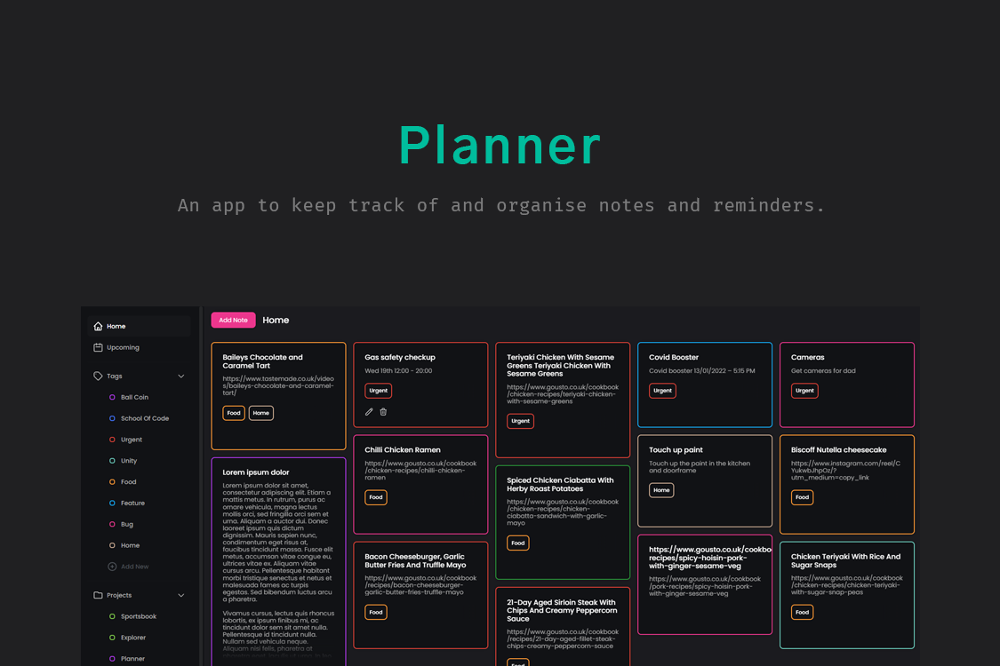

<h1 align="center">
  Planner
</h1>
<p align="center">
 An app that keeps track of and organises notes and reminders hat I built using NextJS. You can visit it <a href="https://planner-jwaterfall.vercel.app/" target="_blank"> here</a>
</p>

## Installation

1. Install the required dependencies

   ```sh
   npm install
   ```

2. Start the development server

   ```sh
   npm run dev
   ```

## Building for production

1. Generate a production build

   ```sh
   npm run build
   ```

2. Start the server

   ```sh
   npm start
   ```
